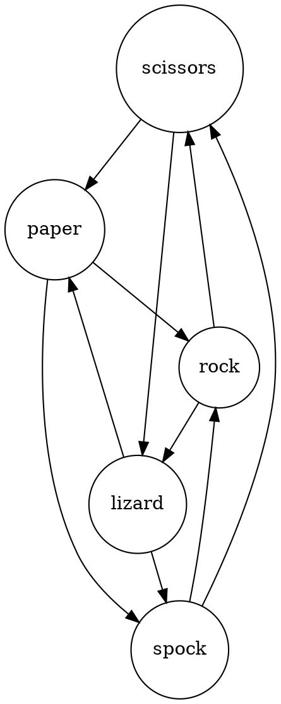
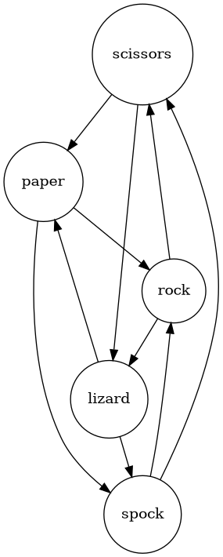
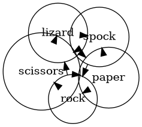
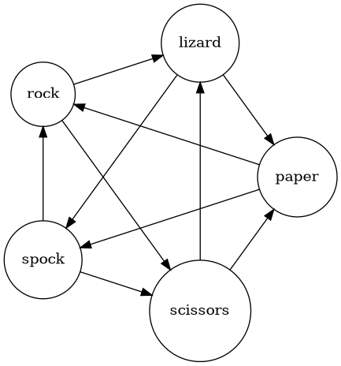
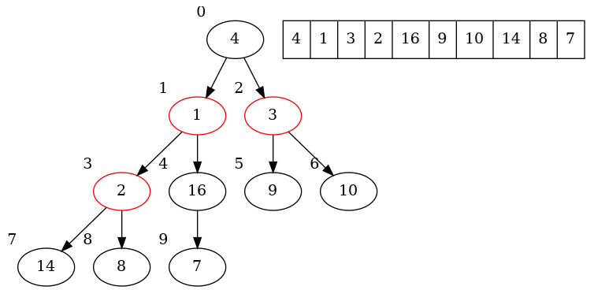
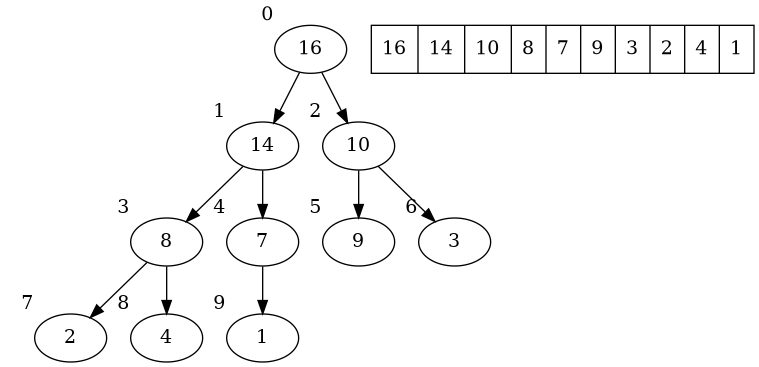
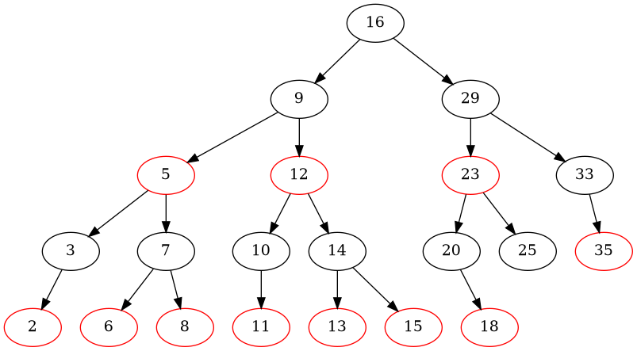

# graphviz

Tons and tons of information at https://graphviz.org/ I'm just scratching the surface here.

## Basic Graphviz

You should think of graphviz as "LaTeX for graphs": you have the classic
separation of information and presentation common to the old Unix-y tools. You can describe the relationships with a human-readable language, then apply a variety of tools to render that image.

Consider "rock paper scissors lizard spock" (http://www.samkass.com/theories/RPSSL.html, or maybe you saw it on Big Bang Theory?):



In this directed graph, we have five labeled nodes and the relationship among those nodes.  Here are a few ways you could render the relationships:

- `dot -Tpng rps.dot -o rps-dot.png` :  the "default tool" tries to avoid crossing lines  
- `neato -Tpng rps.dot -o rps-neato.png`: prioritizes short, equidistant lines between nodes 
- `circo -Tpng rps.dot -o rps-circo.png` : might be good if there are cycles in the graph 

## Graphviz in your program

sure you can use iostream or printf to dump the state of your program but with only a little bit more work you can get a lot more information.

In `heap.h` I have an implementation of the Heap data structure from CLR.   Did
I get it right?  (CLR uses 1-based indexing; I used zero-based -- lots of
chances for off by one errors).

The `print` method in this heap class will walk the tree and generate a dot
graph of the nodes and the backing vector.  Compile with `-DSHOW_TREE` and the
class will print out the state of the tree every time the internal routine
`max_heapify` is invoked.

Well now you have a small problem: the output is multiple digraphs but the
rendering tools only expect to see one.  Well graphviz has another tool for
that called `gvpack`.  You'll end up with all those graphs in one big image.

```
g++ -Wall -g -DSHOW_TREE test_heap.cc -o test_heap
./test_heap | gvpack -u | dot -Tpng -o heap.png
```

That made a very wide image with a dozen intermediate trees.  Here's the
initial state of that heap, before any items are swapped.  The `print` routine
colors red any nodes that violate the max-heap property:



And after a few iterations, the final heap looks like this:


I also used this to help me understand my implementation of red-black trees.
Red-black trees have formal properties which I will omit here (_Introduction to
Algorithms_ covers it better than I ever could), but roughly speaking the tree
should be balanced and if a node is red, its children are black.

Tada! 
