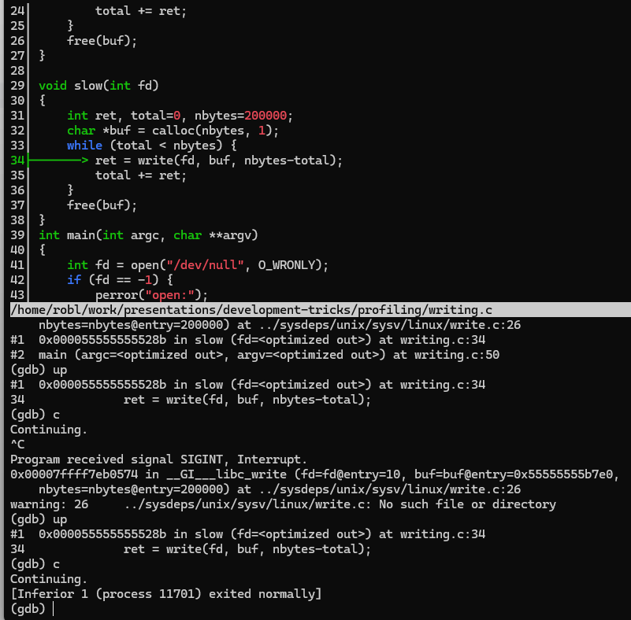

# Stack sampling

There are lots of profilers and visualizers out there.  You are probably
already using `perf`, `dtrace`, `cachegrind`.  But here's a fun one I learned
about a few years ago on stack overflow (
https://stackoverflow.com/a/378024/1024740 ): run your program in a debugger, interrupt
the program a few times, see where you are in the backtrace.  It doesn't seem
like it should work all that well but man it kind of does!

## Challenge: sampling I/O

Take a look at mc-pi.c.  It has three routines that compute pi via monte-carlo, and I call
that in a loop a bunch of times.  Gprof has no problem with this, and shows what you'd expect:

```
% gcc -Wall -g -O2 -pg mc-pi.c -o mc-pi
% time ./mc-pi   ./mc-pi  6.99s user 0.00s system 99% cpu 6.990 total
% gprof -b mc-pi
Flat profile:

Each sample counts as 0.01 seconds.
  %   cumulative   self              self     total
 time   seconds   seconds    calls  ms/call  ms/call  name
 82.49      4.90     4.90      999     4.90     4.90  large_monte
  8.92      5.43     0.53                             _init
  8.42      5.93     0.50      999     0.50     0.50  med_monte
  0.17      5.94     0.01      999     0.01     0.01  small_monte

                        Call graph


granularity: each sample hit covers 4 byte(s) for 0.17% of 5.94 seconds

index % time    self  children    called     name
                                                 <spontaneous>
[1]     91.1    0.00    5.41                 main [1]
                4.90    0.00     999/999         large_monte [2]
                0.50    0.00     999/999         med_monte [4]
                0.01    0.00     999/999         small_monte [5]
-----------------------------------------------
                4.90    0.00     999/999         main [1]
[2]     82.5    4.90    0.00     999         large_monte [2]
-----------------------------------------------
                                                 <spontaneous>
[3]      8.9    0.53    0.00                 _init [3]
-----------------------------------------------
                0.50    0.00     999/999         main [1]
[4]      8.4    0.50    0.00     999         med_monte [4]
-----------------------------------------------
                0.01    0.00     999/999         main [1]
[5]      0.2    0.01    0.00     999         small_monte [5]
-----------------------------------------------

Index by function name

   [3] _init                   [4] med_monte
   [2] large_monte             [5] small_monte
```

this cpu-intensive code ran for about seven seconds, and the profiler sampled about 6 of those
7 seconds.

OK, now consider write.c which does something simliar (three functions, slow, medium, fast) but
instead these functions are writing. system calls give sampling profiliers fits because the program 
is not scheduled while blocked waiting for the result of the system call.   gprof is a little 
less helpful in this case:

```
% gcc -Wall -g -O2 -pg writing.c -o writing
% time ./writing
./writing  4.00s user 0.26s system 99% cpu 4.261 total
% gprof -b writing
Flat profile:

Each sample counts as 0.01 seconds.
  %   cumulative   self              self     total
 time   seconds   seconds    calls  Ts/call  Ts/call  name
 66.67      0.04     0.04                             main
 33.33      0.06     0.02                             _init
```

The program ran for 4 seconds but the profiler saw nothing.
The "interrupt under gdb" approach, though catches this case:


## Use on real program

Here's another story:
We were trying to figure out why our performance on a new system was so much
slower than expected.  Was it the new network? Some operating system feature we
didn't take into account?

(By the way, I used the [STAT tool](https://github.com/LLNL/STAT) to produce
these visualizations but that tool is kind of a pain to set up.  It's packaged
as part of Cray's development tools, though, so the hard work might already be
done for you)

I attached to our benchmark with gdb then hit ctrl-c a few times to interrupt
the program.  Each time, I looked at the backtrace (`bt`).

It only took ten samples to find the problem: That purple `margo_destroy` path is supposed
to be fast.  Definitely should not show up in 10% of the samples, that's for
sure. Turns out we were improperly cleaning up some data structures.  Once we
fixed that, everything looked more reasonable 

